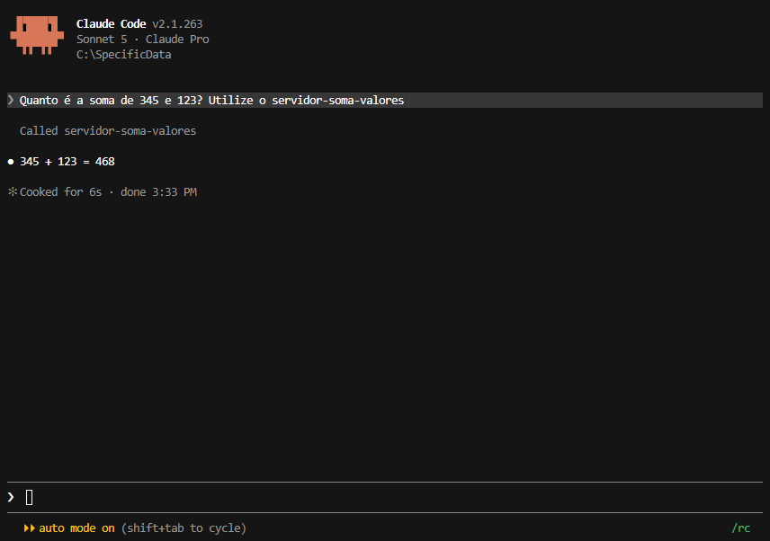

Na primeira vez que tentei criar um servidor com MCP, imaginei que bastava executar o arquivo Python. O processo iniciava normalmente, não havia erro no terminal e o servidor permanecia em execução.

Mas cometi três erros diferentes até conseguir entender como um MCP realmente funciona.

## Descoberta 1 — Um servidor rodando não significa um servidor conectado

Meu primeiro teste foi um servidor extremamente simples.

```python
from mcp.server import MCPServer

mcp = MCPServer("servidor-soma-valores")

@mcp.tool()
def somar_valores(a: int, b: int) -> str:
    """Soma dois números inteiros."""
    return f"O resultado da soma é: {a + b}"

if __name__ == "__main__":
    mcp.run(transport="stdio")
```

Eu executei:
```text
python C:/SpecificData/soma_valores.py
```
O processo ficou vivo, sem erros. Minha expectativa era que o Claude Code encontrasse automaticamente a ferramenta `somar_valores`.

O resultado foi outro: o Claude Code simplesmente não enxergava nenhuma tool.

A descoberta foi entender que um servidor STDIO não "se anuncia" para nenhum cliente. Quem inicia o processo é o cliente MCP, não o servidor.

O registro correto era:
```text
claude mcp add servidor-soma-valores -- python C:/SpecificData/soma_valores.py
```
Depois desse comando, o Claude Code passou a iniciar o processo sempre que necessário e a ferramenta apareceu automaticamente na lista de tools disponíveis.



Lição: executar um servidor manualmente apenas cria um processo Python. Registrar o servidor informa ao Claude Code como iniciar esse processo e disponibilizar suas tools.

## Descoberta 2 — Achei que o modelo chamava a tool diretamente

Depois de registrar o servidor, meu próximo erro foi imaginar que o modelo executava a ferramenta por conta própria. Eu tratava o LLM como quem faria a requisição HTTP ou abriria uma conexão com o servidor.

Na prática, isso nunca acontece.

O fluxo real funciona assim:

O modelo produz algo parecido com uma chamada estruturada:

```json
{
  "name": "somar_valores",
  "arguments": {
    "a": 10,
    "b": 20
  }
}
```
Quem recebe isso é o Claude Code (o host). Ele inicia e mantém a sessão com o servidor MCP, descobre as ferramentas disponíveis e, quando o modelo escolhe uma delas, envia os argumentos e recebe a resposta.

Isso parece um detalhe de arquitetura, mas explica vários comportamentos:

* o modelo não precisa conhecer URLs;
* o modelo não abre conexões HTTP ou TCP dentro do fluxo do MCP;
* toda comunicação externa acontece através da aplicação hospedeira.

Essa separação é exatamente o que permite trocar um servidor local por um servidor remoto sem alterar o comportamento do modelo.

Lição: no MCP, o modelo escolhe uma ferramenta; quem executa a chamada e conversa com o servidor é o cliente MCP.

## Descoberta 3 — A responsabilidade pela segurança é do servidor

Esse foi o erro mais sério.

Eu queria criar uma tool para ler arquivos locais. Minha primeira implementação era praticamente isso:

```python
from mcp.server import MCPServer
from pathlib import Path

mcp = MCPServer("arquivos")

@mcp.tool()
def read_file(path: str) -> str:
    return Path(path).read_text(encoding="utf-8")

if __name__ == "__main__":
    mcp.run(transport="stdio")
```

O problema é que essa tool aceita qualquer caminho informado pelo cliente.

No meu ambiente Windows, chamadas como estas seriam válidas:
```json
{
  "path": "C:\\Users\\Caua\\Documents\\anotacoes.txt"
}
```
Ou até:
```json
{
  "path": "C:\\Users\\Caua\\.ssh\\id_ed25519"
}
```
O servidor executa a leitura usando exatamente as permissões do usuário que iniciou o processo. O protocolo MCP não adiciona nenhuma proteção automaticamente.

A correção é limitar explicitamente o escopo da ferramenta.
```python
from mcp.server import MCPServer
from pathlib import Path

mcp = MCPServer("arquivos")

ROOT = (Path(__file__).parent / "workspace").resolve()

@mcp.tool()
def read_file(path: str) -> str:
    file_path = (ROOT / path).resolve()

    if not file_path.is_relative_to(ROOT):
        raise PermissionError("Arquivo fora do diretório permitido.")

    return file_path.read_text(encoding="utf-8")

if __name__ == "__main__":
    mcp.run(transport="stdio")
```
Existem dois detalhes importantes aqui.

O primeiro é o uso de `resolve()`, que elimina ".." e resolve links simbólicos antes da comparação.

O segundo é a definição do `ROOT` usando `Path(__file__).parent`. Inicialmente eu havia usado `Path("./workspace").resolve()`. Descobri que isso depende do diretório de trabalho do processo. Como quem inicia o servidor é o cliente MCP, o diretório atual pode não ser o mesmo da pasta onde está o script. O resultado é um workspace apontando para outro lugar sem nenhum aviso.

Usar o diretório do próprio arquivo torna a restrição independente de onde o servidor foi iniciado.

Lição: o protocolo MCP define como cliente e servidor conversam. Quem define o que pode ou não ser acessado é o código da tool.

## O que mudou depois dessas três descobertas

Os três erros nasceram da mesma expectativa: eu atribuía ao MCP responsabilidades que pertencem ao cliente ou ao próprio servidor.

- O cliente MCP é responsável por iniciar o servidor e descobrir as tools disponíveis.
- O modelo apenas escolhe uma tool; ele não abre conexões de rede.
- O servidor é responsável por validar o que a tool pode acessar, inclusive no sistema de arquivos.

O protocolo MCP define como cliente e servidor conversam. Descoberta de ferramentas, execução do processo e validação de permissões são responsabilidades da implementação.

Foi essa diferença que transformou um script Python funcionando em um servidor MCP utilizável.